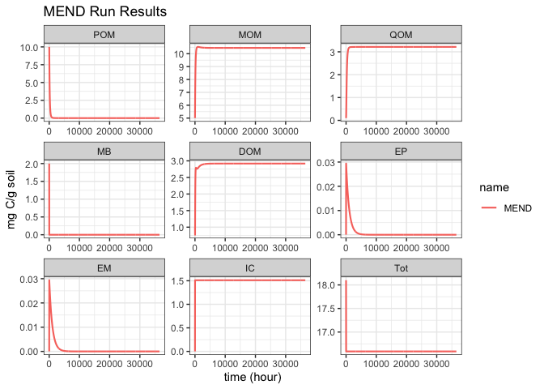
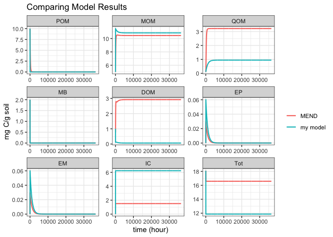

<!-- README.md is generated from README.Rmd. Please edit that file -->

# MEMC

[](https://github.com/Microbial-Explicit-Model/MEMC/actions/workflows/rcmd.yml)
[](https://codecov.io/gh/Microbial-Explicit-Model/MEMC)
[](https://github.com/Microbial-Explicit-Model/MEMC/actions/workflows/pkgdown.yaml)

`MEMC` is a R package that allows users to explore various
representation of soil organic matter (SOM) flux dynamics within a
consistent SOM model structure. Popular microbial-explicit SOM models
such as MEND[^1], MIMICS[^2], and CORPSE[^3] vary significantly in their
formulations of microbial mechanisms and underlying pool structure.
`MEMC` provides a consistent pool structure with flexible flux dynamics:
the conceptual and mathematical formulations of key SOC tranformations
can be rapidly changed. This allows modelers to easily explore the
effects of different conceptualizations of microbial mechanisms.

## Installation

Follow the download and installation instructions for
[R](https://cloud.r-project.org/) and [R
studio](https://www.rstudio.com/products/rstudio/download/).

Use `remotes` to install `MEMC` as a built R package directory from
GitHub.

    # use install.packages("remotes") to install this package the first time.
    library(remotes)

    # Now build and install the R package on your local machine.
    install_github('Microbial-Explicit-Model/MEMC') 

Now load `MEMC` as you would any other package:

``` r
library(MEMC)
```

## Getting Started

The `MEMC` package ships with several already defined model
configuration (see `help(configurations)`). Here we demonstrate how to
run a simulation using the “MEND_model” configuration. For more examples
and package details, please check out our [online
documentation](https://microbial-explicit-model.github.io/MEMC/).
Alternatively, users can look at the `model_configs` table to see all
model configurations included in the package and the microbial dynamics
used in each configuration.

``` r
print(model_configs)
#>       model DOMuptake POMdecomp MBdecay
#> 1      MEND        MM        MM      LM
#> 2 COMISSION        MM       RMM      LM
#> 3    CORPSE       RMM        LM      LM
#> 4      MEMS        LM        LM      LM
#> 5      BAMS        MM        MM      LM
#> 6     MIMCS        MM        MM      DD
```

Look in detail at the pre-built MEND_model configuration (see
`help("MEND_model")` for more details):

``` r
# Printing this MEMC model configuration will return a list defining
# the run name, a table of the flux dynamics, parameter values, and 
# initial SOM pool sizes. 
print(MEND_model)
#> $name
#> [1] "MEND"
#> 
#> $table
#>   model DOMuptake POMdecomp MBdecay
#> 1  MEND        MM        MM      LM
#> 
#> $params
#>    parameter                                              description
#> 1        V_p        maximum specific decomposition rate for POM by EP
#> 2        K_p        half-saturation constant for decomposition of POM
#> 3        V_m        maximum specific decomposition rate for MOM by EM
#> 4        K_m        half-saturation constant for decomposition of MOM
#> 5        V_d       maximum specific uptake rate of D for growth of MB
#> 6        K_d half-saturation constant of uptake of D for growth of MB
#> 7        f_d                fraction of decomposed P allocated to DOM
#> 8        g_d                      fraction of dead B allocated to DOM
#> 9       p_ep                      fraction of mR for production of EP
#> 10      p_em                      fraction of mR for production of EM
#> 11      r_ep                                      turnover rate of EP
#> 12      r_em                                      turnover rate of EM
#> 13     Q_max                            maximum DOC sorption capacity
#> 14     K_ads                                 specific adsorption rate
#> 15     K_des                                          desorption rate
#> 16   dd_beta            strength of density dependent microbial decay
#> 17 Input_POM                                               POM input 
#> 18 Input_DOM                                                DOM input
#> 19       CUE                                    carbon use efficiency
#>              units   value
#> 1  mgC mgC^-1 h^-1  14.000
#> 2     mgC / g soil  50.000
#> 3  mgC mgC^-1 h^-1   0.250
#> 4      mg C/g soil 250.000
#> 5  mgC mgC^-1 h^-1   3.000
#> 6      mg C/g soil   0.250
#> 7             <NA>   0.500
#> 8             <NA>   0.500
#> 9             <NA>   0.010
#> 10            <NA>   0.010
#> 11 mgC mgC^-1 h^-1   0.001
#> 12 mgC mgC^-1 h^-1   0.001
#> 13    mgC / g soil   3.400
#> 14 mgC mgC^-1 h^-1   0.006
#> 15 mgC mgC^-1 h^-1   0.001
#> 16            <NA>   1.000
#> 17            mg C   0.000
#> 18            mg C   0.000
#> 19                   0.400
#> 
#> $state
#>      POM      MOM      QOM       MB      DOM       EP       EM       IC 
#> 10.00000  5.00000  0.10000  2.00000  1.00000  0.00001  0.00001  0.00000 
#>      Tot 
#> 18.10002
```

Perform a run using the MEND model:

``` r
time <- seq(0, 36500, by = 25) 
mend_out <- memc_solve(mod = MEND_model, time = time)
```

`memc_solve` returns a long-format data frame with the state of the
model pool at each time point. This makes it easy to plot the results:

``` r
ggplot(data = mend_out) + 
  geom_line(aes(time, value, color = name), linewidth = 0.75) + 
  facet_wrap("variable", scales = "free") + 
  labs(y = "mg C/g soil", 
       x = "time (hour)",
       title = "MEND Run Results")
```



## Building a Custom Model

`MEMC` allows users to easily run simulations with the provided model
configurations and also build customized models of their own design by
selecting any combination of the supported flux dynamics, and/or
modifying the model parameters. For this example we will use the default
parameter and initial pool values that are included as package data (see
`help(memc_state_ultisol)` and `help(default_initial)` for more
information).

``` r
# Use memc_configure to print a table describing the model configuration 
my_model <- memc_configure(params = default_params, 
                           state = memc_state_ultisol, 
                           name = "my model", 
                           DOMuptake = "MM", 
                           POMdecomp = "LM", 
                           MBdecay = "LM")
#> |model    |DOMuptake |POMdecomp |MBdecay |
#> |:--------|:---------|:---------|:-------|
#> |my model |MM        |LM        |LM      |
```

Run our customized model…

``` r
time <- seq(0, 36500, by = 25) 
my_out <- memc_solve(mod = my_model, time = time)
```

…and compare its output with the MEND model results from above:



Changing the POM and DOM decomposition flux dynamics affects model
behavior! The flexibility of the flux dynamics makes `MEMC` a powerful
tool for rapid SOM model exploration.

Additional features supported by `MEMC` include the ability to change
model parameters, perform sensitivity analyses, and fit models with
experimental/observational data (see [online
documentation](https://microbial-explicit-model.github.io/MEMC/) for
examples featuring capabilities).

[^1]: Wang, Gangsheng, Sindhu Jagadamma, Melanie A. Mayes, Christopher
    W. Schadt, J. Megan Steinweg, Lianhong Gu, and Wilfred M. Post.
    2015. “Microbial Dormancy Improves Development and Experimental
    Validation of Ecosystem Model.” The ISME Journal 9 (1): 226–37.

[^2]: .Wieder, William R., Steven D. Allison, Eric A. Davidson, Katerina
    Georgiou, Oleksandra Hararuk, Yujie He, Francesca Hopkins, et
    al. 2015. “Explicitly Representing Soil Microbial Processes in Earth
    System Models.” Global Biogeochemical Cycles 29 (10): 1782–1800.

[^3]: Sulman, Benjamin N., Jessica A. M. Moore, Rose Abramoff, Colin
    Averill, Stephanie Kivlin, Katerina Georgiou, Bhavya Sridhar, et
    al. 2018. “Multiple Models and Experiments Underscore Large
    Uncertainty in Soil Carbon Dynamics.” Biogeochemistry 141 (2):
    109–23.
