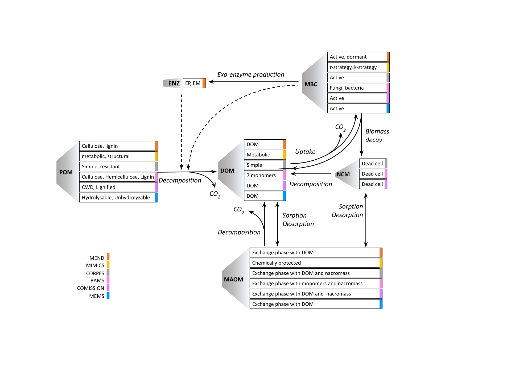

```{r, include = FALSE, echo = FALSE, warning = FALSE, message = FALSE}
knitr::opts_chunk$set(
  collapse = TRUE,
  comment = "#>", 
  fig.width = 8, 
  fig.height = 5
)

library(ggplot2)
theme_set(theme_bw(base_size = 14))
```

# Motivation

Microbial explicit carbon models include process-based representations of microbial activity in soil carbon models. However, microbial-explicit models are diverse in terms of pool structure, representations of carbon flux dynamics, and environmental drivers, as illustrated in **Figure 1**.



\
The variations in carbon model structures and dynamics contribute to diverging long-term model projections, making model inter-comparisons difficult. In order to explore, attribute, and better understand the implications of varying the representations of the C dynamics, the Microbial Explicit Model Consortium (MEMC) adopts a uniform pool structure to enable easy model comparison exercises. By implementing MEMC as an R package, we hope to make soil carbon modeling accessible to a wider audience. 
\

# Model Structure

MEMC uses the common model structure visualized in **Figure 2**. In the first version of this package, users have the ability to decide which implementation POC decomposition (1), DOC uptake (2), and microbial biomass decay (3) as indicated in (**Figure 3**). This flexible framework allows users to isolate the effects of flux dynamics on model behavior. 

![**Figure 2:** Conceptual diagram of the soil organic carbon pool structure used by MEMC. The pools include particulate organic carbon (POC), mineral-associated organic carbon matter (MAOM),  dissolved organic carbon (DOC), adsorbed phase of DOC (QOC), microbial biomass (MB), POC-degrading enzymes (EP), and MOC-degrading enzymes (EM). External inputs for POC and DOC are directly are fed into the pools respectively. The fluxes between the pools are detonated with solid arrows, they include POC decomposition (1), DOC uptake by microbial biomass (2), mineral-associated carbon decomposition, adsorption of DOC, microbial biomass decay (3), and enzyme production used in POC and DOC decomposition and enzyme turn over. The dashed arrows indicate enzymes that affect flux rate.](pool_structure.png)


# Model Configurations


The MEMC R package ships with six model pre-configured models (MICMS, MEND, CORPSE, BAMS, COMISSION, and MEMS). All of these model implementations use the uniform pool structure from **Figure 2**  but use a different combination of C flux dynamics as indicated in **Figure 3**. 


# Dynamics 

* **MM:** Michaelis Menten model, a commonly used equation in biogeochemical modelings which describe the rate of a reaction in response to a change in substrate. 
* **Reverse MM:** Reverse Michaelis Menten model (RMM), a modified version of Michaelis Menten model, however now the modeled reaction rate changes varies in response to enzyme availability.
* **Linear:** a simple linear model (LM) is used. 
* **Density Dependent:** in the Density Dependent (DD) model the density of the population (the microbial biomass) affects the rate of a given process.  
* **ECA:** Equilibrium Chemistry Approximation kinetics an alternative representation of biogeochemical processes that is more appropriate over a wide range of substrate availability. 


