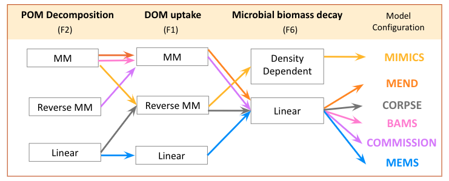

```{r, include = FALSE, echo = FALSE, warning = FALSE, message = FALSE}
knitr::opts_chunk$set(
  collapse = TRUE,
  comment = "#>", 
  fig.width = 8, 
  fig.height = 5
)

library(ggplot2)
theme_set(theme_bw(base_size = 14))
```


### Model Structure

The MEMC package provides users with the ability to explore alternative configurations of a soil organic matter (SOM) model with alternative structural formulations (i.e. representations of fluxes between carbon pools). MEMC uses the common model structure visualized in Figure 1. In the first version of this package, users have the ability to decide which implementation of DOM uptake (F1), POM decomposition (F2), and microbial biomass decay (F8) should be used with the MEMC pool structure (Figure 2). This flexible framework allows users to isolate the effects of flux dynamics on model behavior. 

![Figure 1: Conceptual diagram of the soil organic matter pool structure used by MEMC. The pools include particulate organic matter (POM), mineral-associated organic carbon matter (MOM),  dissolved organic carbon matter (DOM), adsorbed phase of DOM (QOM), microbial biomass (MB), POM-degrading enzymes (EP), and MOM-degrading enzymes (EM). External inputs for POM, DOM, and MOM are directly are fed into POM, DOM, and MOM, respectively. The fluxes between the pools are detonated with solid arrows, they include DOM uptake by microbial biomass (F1), POM decomposition (F2), mineral-associated carbon decomposition (F3), adsorption of DOC (F4), microbial biomass decay (F6), and enzyme production used in POM and DOM decomposition (F7) and enzyme turn over (F8). The dashed arrows indicate pools that affect flux rates.](MEMC_conceptual_diagram.png)





TODO?? 


### MM 

### Reverse MM 

### Linear 

### Density Dependent 


TODO add descipritons of the MM, RMM, Linear, Den


