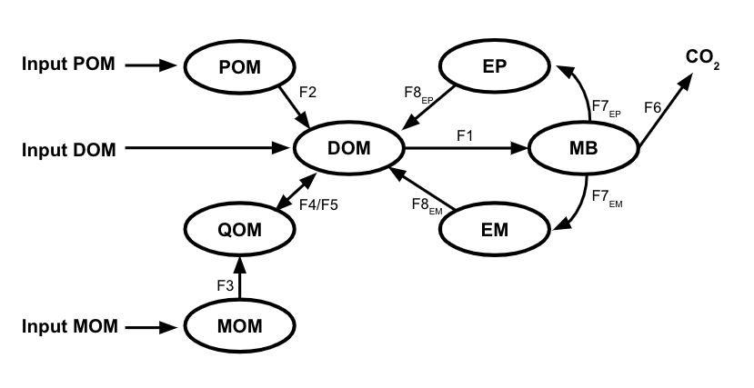

```{r, include = FALSE}
knitr::opts_chunk$set(
  collapse = TRUE,
  comment = "#>"
)
```

After following the [installation instructions](Install-Build.html) you should be ready to follow along with this tutorial where we will walk thorough basic MEMC run, change parameter values, and initial conditions.


# Model Overview


* TODO add text about the different pools & the flux names 
* TODO feedback from JZ on the strucutre/names 


# Basic Run 

```{r setup}
library(MEMC)

library(ggplot2) # package used to visualize results
theme_set(theme_bw() + theme(legend.title = element_blank()))
```

Start by building the default MEMC model configuration, using the default parameter values and initial state conditions.

```{r, message=FALSE, warning=FALSE}
mod <- configure_model(params = default_params, state = default_initial, name = "Default")
```

The `mod` object created by [configure_model](../reference/configure_model.html) has information about the model configuration name, a table defining the kinetics used, the parameters, and initial state conditions for the model configuration.  

Solve the model at the various time steps. 

```{r}
time <- seq(0, 36500, by=25) 
out1 <- solve_model(mod, time)
```


Visualize the run results. 

```{r}
ggplot(data = out1) + 
  geom_line(aes(time, value, color = name), size = 0.75) + 
  facet_wrap("variable", scales = "free") + 
  labs(y = "mg C/g soil", 
       title = "Default MEMC Run")
```


# Change Initial State Conditions 


```{r}
# Double the size of the biomass pool
new_initial_cond <- default_initial
new_initial_cond[["MB"]] <- new_initial_cond[["MB"]] * 2

# You can either configure a new model using the new initial conditions or pass the 
# new initial conditions to the model configuration using the solve_model function.
out2 <- solve_model(mod, time, state = new_initial_cond)

# Rename the output run. 
out2$name <- "Double MB"
```

```{r}
to_plot <- rbind(out1, out2) 

ggplot(to_plot) +
  geom_line(aes(time, value, color = name, linetype = name), size = 0.75) + 
  facet_wrap("variable", scales = "free") + 
  labs(y = "mg C/g soil", 
       title = "Change Initial State Conditions")
```

# Change a Parameter Value

Pass in a new parameter value. 

```{r}
out3 <- solve_model(mod, time, params = c("V_d" = 10))
out3 $name <- "Increase V_d"
```

Visualize model runs. 

```{r}
to_plot <- rbind(out1, out3) 

ggplot(to_plot) +
  geom_line(aes(time, value, color = name, linetype = name), size = 0.75) + 
  facet_wrap("variable", scales = "free") + 
  labs(y = "mg C/g soil", 
       title = "Change V_d")
```
