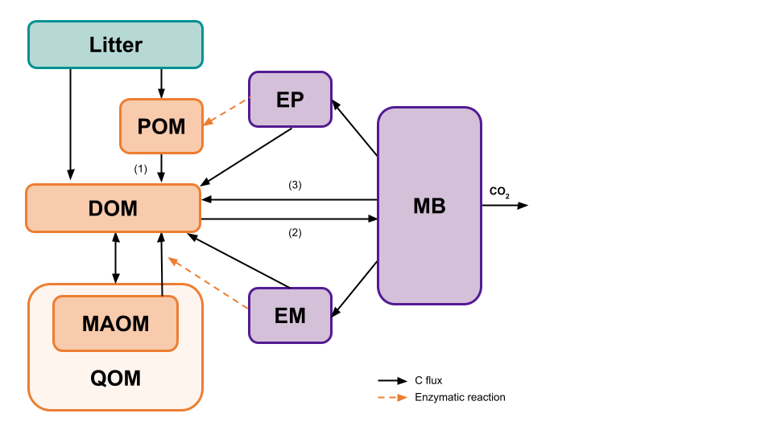

```{r, include = FALSE, echo = FALSE, warning = FALSE, message = FALSE}
knitr::opts_chunk$set(
  collapse = TRUE,
  comment = "#>", 
  fig.width = 8, 
  fig.height = 5
)
library(MEMC)
library(ggplot2)
theme_set(theme_bw(base_size = 14))
```


The `configure_model` function allows users to build their own SOM model. All of the MEMC models use the same SOM pool structure but users will be able to decide which of the following dynami



The `configure_model` function allows users to build their own SOM model. All of the MEMC models use the same SOM pool structure but users will be able to decide which of the formulations (LM, MM, RMM, ECA, or DD) are used for POM decomposition (1), DOM uptake (2), and microbial biomass decay (3). The following example will demonstrate how changing the DOM uptake flux impacts the model projections. 

Set up the model configuration using the default paramaters and inital carbon pool values. 


```{r}
# Running configure_model will print a table describing the model configuration. 
mod1 <- configure_model(params = default_params, 
                            state = default_initial, 
                            name = "Model 1", 
                            DOMuptake = "MM", 
                            POMdecomp = "LM", 
                            MBdecay = "LM")
```


Use `solve_model` to run our model. 

```{r, warning=FALSE}
mod1_out <- solve_model(mod = mod1, time = 0:50)
head(mod1_out)
```


Now switch the DOM uptake to use the RMM dynamics. 

```{r}
# Running configure_model will print a table describing the model configuration. 
mod2 <- configure_model(params = default_params, 
                            state = default_initial, 
                            name = "Model 2", 
                            DOMuptake = "RMM", 
                            POMdecomp = "LM", 
                            MBdecay = "LM")
mod2_out <- solve_model(mod = mod2, time = 0:50)
```


Now try setting the DOM uptake to ECA dynamics. 


```{r}
# Running configure_model will print a table describing the model configuration. 
mod3 <- configure_model(params = default_params, 
                            state = default_initial, 
                            name = "Model 3", 
                            DOMuptake = "ECA", 
                            POMdecomp = "LM", 
                            MBdecay = "LM")
mod3_out <- solve_model(mod = mod3, time = 0:50)
```


Compare the model results with one another. 


```{r, echo = FALSE}
ggplot(data = rbind(mod1_out, mod2_out, mod3_out)) + 
  geom_line(aes(time, value, color = name), linewidth = 0.75) + 
  facet_wrap("variable", scales = "free") + 
  labs(y = "mg C/g soil", 
       title = "Comparing Model Results") +
  theme(legend.title = element_blank())
```


For more examples and tutorials please see our [online documentation](https://microbial-explicit-model.github.io/MEMC/).


